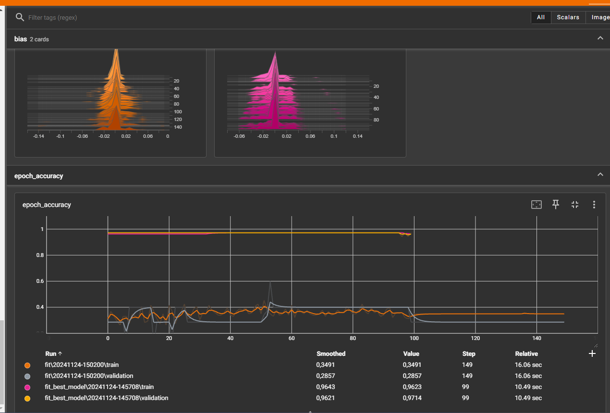

# TensorFlow Projects

Projekty dotyczą uczenia maszynowego opartego na TensorFlow.

## Table of Contents
- [Zadanie 1: MNIST Rozpoznawanie Liczb](#zadanie-1-mnist-rozpoznawanie-liczb)
- [Zadanie 2: Macierz TensorFlow](#zadanie-2-macierz-tensorflow)
- [Zadanie 3: Klasyfikacja Wina 1](#zadanie-3-klasyfikacja-wina-1)
- [Zadanie 4: Klasyfikacja Wina 2](#zadanie-4-klasyfikacja-wina-2)
- [Zadanie 5: Klasyfikacja Wina 3](#zadanie-5-klasyfikacja-wina-3)
- [Zadanie 6: Convolutional Neural Networks (CNN)](#zadanie-6-convolutional-neural-networks-cnn)
- [Zadanie 7: Autoencoder](#zadanie-7-autoencoder)
- [Zadanie 8: LSTM](#zadanie-8-lstm)

---

## Zadanie 1: MNIST Rozpoznawanie Liczb
Konfiguracja środowiska TensorFlow oraz testowe uruchomienie modelu klasyfikującego cyfry z zestawu MNIST. Model oparty na sieci neuronowej z warstwami Dense oraz Dropout. Wykonanie eksperymentów z zapisanym modelem oraz krzywą uczenia.

## Zadanie 2: Macierz TensorFlow
Praca z tensorami w TensorFlow - implementacja funkcji do obrotu punktu względem początku układu współrzędnych oraz rozwiązanie układów równań liniowych. Obsługa wejścia z linii poleceń oraz walidacja danych.

## Zadanie 3: Klasyfikacja Wina 1
Analiza zbioru Wine z UCI Repository, preprocessing danych oraz implementacja klasyfikatora opartego na sieci neuronowej. Eksperymentowanie z różnymi architekturami modelu, funkcjami aktywacji oraz wizualizacja wyników w TensorBoard.

### Implementowane modele
W eksperymencie zostało przetestowanych kilka modeli sieci neuronowych z różnymi konfiguracjami. Główne zmienne to liczba warstw i neuronów, wartość dropout oraz szybkość uczenia – learning_rate. Modele różniły się architekturą, począwszy od prostszych (np. warstwy [64, 32]) po bardziej złożone (np. warstwy [128, 64, 32]). Wprowadzono również mechanizm dropout, aby ocenić wpływ regularizacji na wyniki.

### Krzywe uczenia i dokladnosc modelu
Podczas trenowania modelu najlepsze wyniki osiągnięto dla konfiguracji: learning_rate = 0.001, warstwy [128, 64, 32] i brak dropout. Model ten uzyskał najwyższą dokładność walidacyjną (97,14%) oraz testową (83,33%). Krzywe uczenia pokazują, że model konwerguje stabilnie, a różnica między dokładnością zbioru uczącego a walidacyjnego nie wskazuje na przetrenowanie.

### Krzywa uczenia

### Porównanie wyników modeli
Dwa modele bazowe osiągnęły niższe wyniki:
•	Model 1: Val Acc = 91,43%, Test Acc = 77,78%
•	Model 2: Val Acc = 40,00%, Test Acc = 55,56%
Najlepszy model przewyższał modele bazowe pod względem dokładności testowej i walidacyjnej. Można zauważyć, że dodanie większej liczby neuronów i brak dropout poprawiło zdolność modelu do generalizacji.

### Wnioski
Model z warstwami [128, 64, 32] i learning_rate = 0.001 najlepiej sprawdził się w tym zadaniu. Wysoka dokładność walidacyjna sugeruje, że model dobrze dopasował się do wzorców w danych. Dropout w niektórych przypadkach obniżył skuteczność modelu, co może sugerować, że dane były już wystarczająco różnorodne i regularizacja nie była potrzebna. Możliwe, że dalsza optymalizacja hiperparametrów mogłaby jeszcze bardziej poprawić wyniki.

## Zadanie 4: Klasyfikacja Wina 2
Optymalizacja hiperparametrów modelu poprzez eksperymenty na zbiorach treningowym, walidacyjnym i testowym. Porównanie różnych układów sieci oraz tempa uczenia, automatyzacja procesu i wybór najlepszego modelu.

## Zadanie 5: Klasyfikacja Wina 3
Dalsza optymalizacja modelu poprzez tuning architektury sieci neuronowej. Wprowadzenie dodatkowych funkcji analizy i interpretacji wyników. Finalizacja modelu do przewidywania kategorii wina na podstawie cech.

## Zadanie 6: Convolutional Neural Networks (CNN)
W tym zadaniu implementujemy sieć neuronową do klasyfikacji cyfr MNIST, wykorzystując warstwy konwolucyjne (Conv2D) oraz operacje pooling (MaxPooling2D). Sieci konwolucyjne są bardziej efektywne niż w pełni połączone, ponieważ wykorzystują lokalne połączenia i współdzielenie wag, co znacząco redukuje liczbę parametrów do wyuczenia. Kluczowe jest sprawdzanie kształtu warstw oraz regularne wywoływanie model.summary(), aby lepiej zrozumieć architekturę i poprawnie dobrać hiperparametry.

## Zadanie 7: Autoencoder
Implementacja autoenkodera do redukcji wymiarowości i analizy struktury danych. Eksperymenty z różnymi konfiguracjami sieci oraz wizualizacja wyników rekonstrukcji danych.

## Zadanie 8: LSTM
Model oparty o LSTM który będzie przewidywał wartość funkcji po zadanych N krokach. Rysuje wykres sinusoidalny.